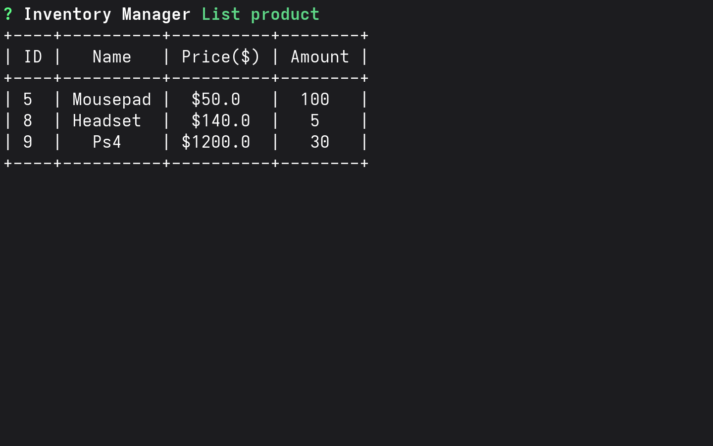
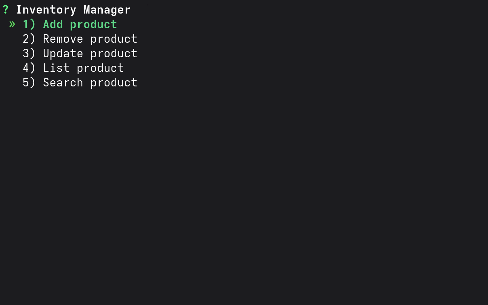
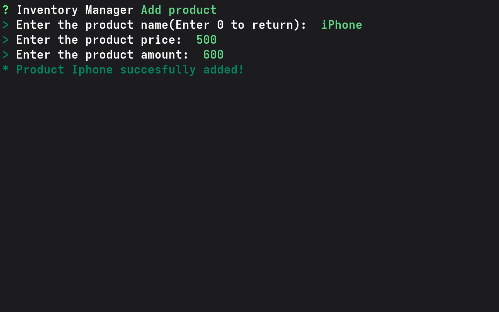
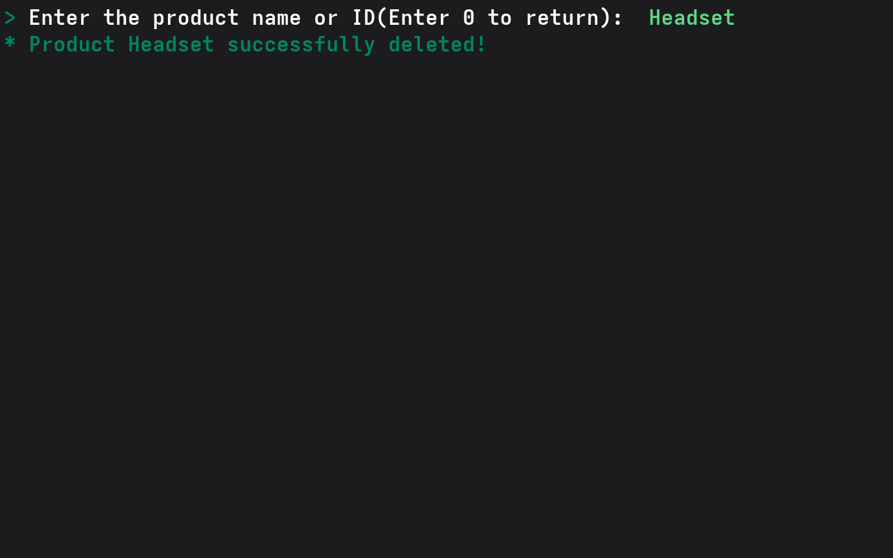
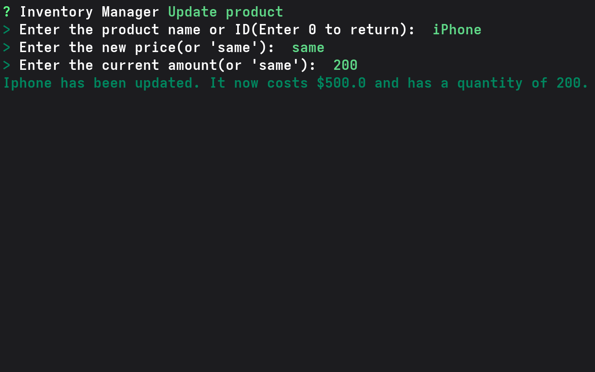
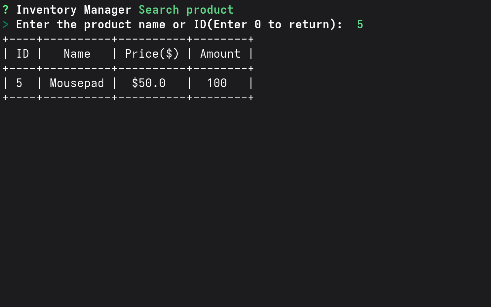

# 📦 Inventory Manager CLI
A beautifully interactive Command-Line Interface (CLI) application for managing product inventory, built with Python and SQLite. 



## ✨ Features

- **Add Product:** Easily add new products with their name, price, and quantity.
- **Remove Product:** Delete a product from the inventory using its ID or name.
- **Update Product:** Modify the price or quantity of an existing product.
- **List Products:** Display all inventory items in a clean, formatted table.
- **Search Product:** Quickly find a specific product by its ID or name to view its details.

## 🛠️ Tech Stack

- **[Python 3](https://www.python.org/)** - Core programming language.
- **[Questionary](https://questionary.readthedocs.io/)** - For building the interactive and beautifully styled command-line user prompts.
- **[PrettyTable](https://pypi.org/project/prettytable/)** - For formatting the inventory data into visually appealing ASCII tables.
- **[SQLite](https://www.sqlite.org/)** - For lightweight, disk-based database storage.

## Demo
▶ **Video demonstration**

https://github.com/user-attachments/assets/9f6ec0ee-96f4-4b46-9d58-57de7dc8916f

## Screenshots

### Main Menu


### List Products


### Add Product


### Remove Product


### Update Product


### Search Product



## 🚀 Getting Started
### Prerequisites
Make sure you have Python 3 installed on your system. You will also need to install the required dependencies.
```bash
# Install the required Python packages
pip install questionary prettytable
```
### Running the Application
To start the Inventory Manager CLI, simply run the `main.py` script:
```bash
cd src
python3 main.py
```
## 🎮 Usage
Once you start the application, you'll be greeted with an interactive menu. Use your arrow keys to navigate the options and press `Enter` to select an action:
```text
? Inventory Manager (Use arrow keys)
 ❯ Add product
   Remove product
   Update product
   List product
   Search product
```
